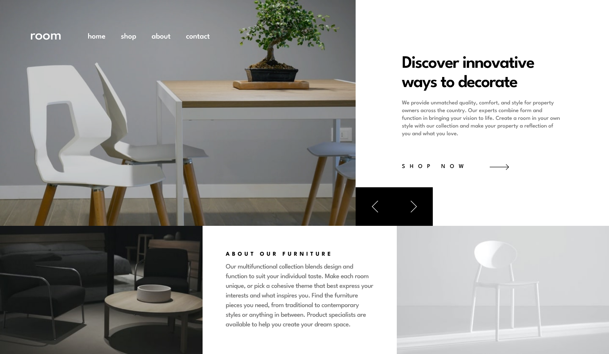

# Frontend Mentor - Room homepage solution

This is a solution to the [Room homepage challenge on Frontend Mentor](https://www.frontendmentor.io/challenges/room-homepage-BtdBY_ENq). Frontend Mentor challenges help you improve your coding skills by building realistic projects.

## Overview

### The challenge

Users should be able to:

-   View the optimal layout for the site depending on their device's screen size
-   See hover states for all interactive elements on the page
-   Navigate the slider using either their mouse/trackpad or keyboard

### Screenshot

### Links

-   Solution URL: [GitHub](https://github.com/MarcinFiuk/ROOM-homepage-frontendmentoror)
-   Live Site URL: [Vercel](https://room-homepage-frontendmentoror.vercel.app/)

## My process

### Built with

-   Semantic HTML5 markup
-   [Tailwind CSS](https://tailwindcss.com/) - CSS framework
-   [React](https://reactjs.org/) - JS library

## Author

-   Linkedin - [Marcin Fiuk](https://www.linkedin.com/in/marcin-fiuk-0b498b241/)
-   Frontend Mentor - [@MarcinFiuk](https://www.frontendmentor.io/profile/MarcinFiuk)
-   Twitter - [@marcin_fiuk](https://twitter.com/marcin_fiuk)
